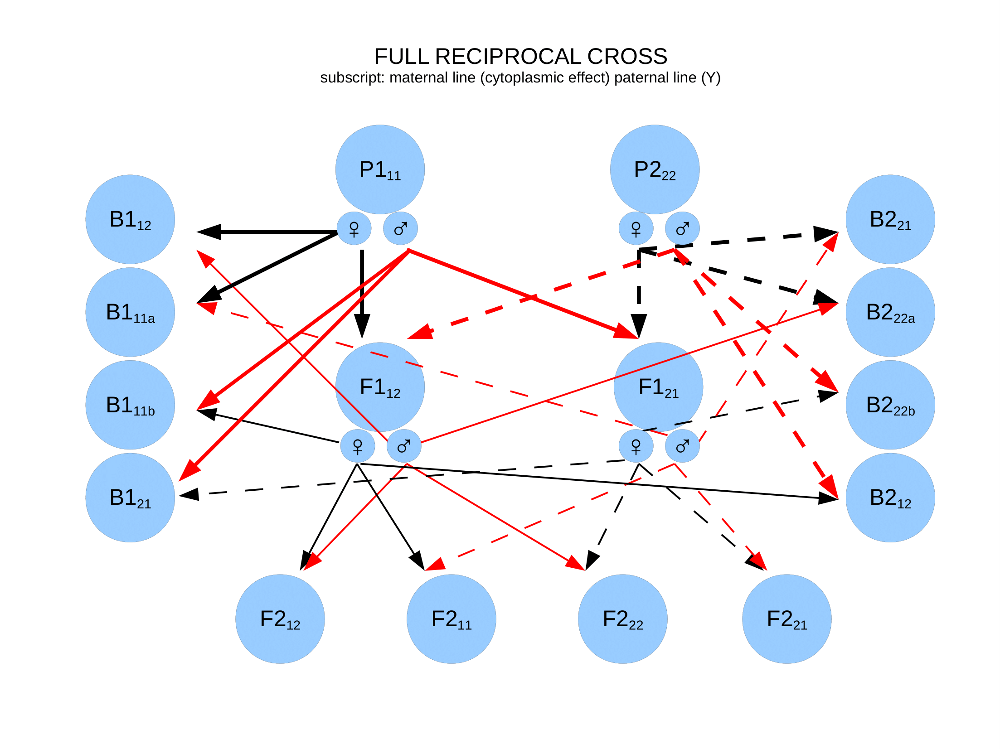

```{r}
library(linecross)
```

## Data
The data is from Campbell et al. (2008) on a cross between two species of *Ipomopsis*, the scarlet gilia *I. aggregata* and the slendertube skyrocket *I. tenuituba*. The trait is proportion of survived seeds surviving until reproduction planted in the environment native to *I. aggregata*. The data were extracted from Figure 3A in Campbell et al. (2008).

```{r}
d<-ipomopsis
d
```
This data format is required for fitting the different line-cross models using `lcross` function. The three required columns are the name of each experimental population (see figure below for explanation), the mean of each derivative, and the standard error of this mean. The name of the columns must be exactly as in this example and also the name of the populations. The derivatives column must be formatted as `character`, and means and standard errors must be `numeric`. 

The first number in "subscripts" of the derivatives (i.e. what is written after _ in the required data format) represent the maternal line, so that 1 means that the maternal line originates from P1 and 2 means that the maternal line originates from P2. The second number represent the paternal line. This figure illustrates the setup, with black solid and dashed lines indicating maternal inheritance from P1 and P2, respectively, and red solid and dashed lines indicating paternal inheritance from P1 and P2 respectively:

```{r, out.width = '100%', echo = FALSE}

```
There are no-reciprocal modelsimplmented in the `linecross` package, but the data format is set up in such a way that such models can be included in the future. Because the currently implemented models does not use reciprocal information, the models does not differentiate between the different F1s, F2s, B1s or B2s, but rather uses the weighted average of each group. Hence, in cases where the are no reciprocal information available in the data, say there is only one mean for F2, which includes all or some of the possible reciprocal crosses, it does not matter for the model fitting whether this F2 is labelled F2_12, F2_21, F2_11 or F2_22 in the data file. 


## Models
Because we have data on a fitness component (survival) it makes sense to test what type of epistasis that that is involved in postzygotic isolation. These are all versions of the general epistasis model. We chose to use F1 as the reference in our models. (The reference is the population in which the genetic effects are measured.)

```{r}
modlist <- list(
  "Additive" = lcross(model = "additive", ref = "F1", data = d),
  "Dominance" = lcross(model = "dominance", ref = "F1", data = d),
  "Add and dom" = lcross(model = "add_dom", ref = "F1", data = d),
  "Within pop epistasis" = lcross(model = "generalW", ref = "F1", data = d),
  "Between pop epistais" = lcross(model = "generalB", ref = "F1", data = d),
  "Within and between pop epistasis" = lcross(model = "generalWB", ref = "F1", data = d),
  "General epistasis model" = lcross(model = "general", ref = "F1", data = d))


cbind(
  "k" = lapply(modlist, function(x) length(x$parameters)),
  "R-squared" = lapply(modlist, function(x) round(x$Rsquare, 2)),
  "AIC" = lapply(modlist, function(x) round(x$AIC, 1)))
```
The best model is the within and between epistasis model, slightly better than the more complex general epistasis model. Although it is hard to judge for so few data points, the residuals of the best model seem fairly close to normally distributed, allowing AIC comparison of models: 

```{r}
mod <- modlist$`Within and between pop epistasis`
#mod <- modlist$`General epistasis model`

par(mfrow = c(2,2))
plot(mod$data$est, mod$data$resid,
     xlab = "Fitted values", ylab = "Residuals",
     main = "Original values")
abline(h = 0)
plot(mod$data$transformed.est, mod$data$transformed.resid,
     xlab = "Fitted values", ylab = "Residuals",
     main = "Transformed values")
abline(h = 0)
qqnorm(mod$data$resid, main = NULL)
qqline(mod$data$resid)
qqnorm(mod$data$transformed.resid, main = NULL)
qqline(mod$data$transformed.resid)
par(mfrow = c(1,1))

```
The parameter estimates of the best model are:
```{r}
round(
cbind(
  "Estimate" = mod$parameters,
  "SE"       = mod$parameters.se
  ), 3)
```
The reference effects Y1 and Y2 were both negative, but the effect of substituting P2P2 genoypes into the reference, given by Y1, is stronger than the effect of substituting P1P1 genotypes into the reference. The reference effects alone predict negative survival in the P1 and P2 (i.e. 12.3\% and 17.5\% lower than the 8.1\%, respectively). However, this negative effect is mitigated by the within population epistasis. Hence, the P1 has `Y1 + Ew` = `r -12.3+13.2`\% higher survival than P1, while P2 has survival reduction of `Y2 + Ew` = `r -17.3+13.2`\% compared to the reference. The positive within population epistasis contributes to a higher survival of the parental populations relative to the hybrid populations, and in this sense the model is in line with a model of postzygotic isolation. However, the F2 has a relatively high fitness. This is due to the strong between population epistasis, which contributes to an increased survival of the F2 by `Eb/8 ` = `r round(48.1/8, 1)`\%. 

 
```{r}
fullmod <- modlist$`General epistasis model`

round(
cbind(
  "Estimate" = fullmod$parameters,
  "SE"       = fullmod$parameters.se
  ), 3)

```
The parameter estimates of the general epistasis model (the most complex model), where the within population epistasis (E11 and E22) is allowed to differ between the parentals. The between population epiststasis is given by the parameter E12.

An important assumption of line cross studies is that natural selection does not affect the line cross means. To test this we use a model of threshold selection on liability of survival and assume an heritability of 0.2:

```{r}
d<-ipomopsis

h2 <- 0.2
integrand <- function(x) x*dnorm(x) # needed for the selection intensity
sel_int <- function(Ps) integrate(integrand, qnorm(1-Ps), Inf)$value/Ps


dl_P1 <- h2*sel_int(d$mean[d$pop %in% c("P1")])
dl_P2 <- h2*sel_int(d$mean[d$pop %in% c("P2")])
dl_F1 <- h2*sel_int(d$mean[d$pop %in% c("F1_12")])/2+h2*sel_int(d$mean[d$pop %in% c("F1_21")])/2

d$liab_uncorr <- qnorm(d$mean)
d$liab[d$pop%in%c("F1_12","F1_21")] <- d$liab_uncorr[d$pop%in%c("F1_12","F1_21")] - mean(c(dl_P1, dl_P2))
d$liab[d$pop%in%c("F2_12")] <- d$liab_uncorr[d$pop%in%c("F2_12")] - mean(c(dl_P1, dl_P2)) - dl_F1
d$liab[d$pop%in%c("B1_12","B1_11b")] <- d$liab_uncorr[d$pop%in%c("B1_12","B1_11b")] - mean(c(dl_P1, dl_P2)) - mean(c(dl_P1, dl_F1))
d$liab[d$pop%in%c("B2_21","B2_22b")] <- d$liab_uncorr[d$pop%in%c("B2_21","B2_22b")] - mean(c(dl_P1, dl_P2)) - mean(c(dl_P2, dl_F1))

d$mean<-pnorm(d$liab)

modlist <- list(
  "Additive" = lcross(model = "additive", ref = "F1", data = d),
  "Dominance" = lcross(model = "dominance", ref = "F1", data = d),
  "Add and dom" = lcross(model = "add_dom", ref = "F1", data = d),
  "Within pop epistasis" = lcross(model = "generalW", ref = "F1", data = d),
  "Between pop epistais" = lcross(model = "generalB", ref = "F1", data = d),
  "Within and between pop epistasis" = lcross(model = "generalWB", ref = "F1", data = d),
  "General epistasis model" = lcross(model = "general", ref = "F1", data = d))

cbind(
  "k" = lapply(modlist, function(x) length(x$parameters)),
  "R-squared" = lapply(modlist, function(x) round(x$Rsquare, 2)),
  "AIC" = lapply(modlist, function(x) round(x$AIC, 1)))

```
Assuming selection makes a large difference. The whihtin population epistasis is much more important than teh between population epistasis in explaining the data under this scenario. The parameter estiamtes of the general epistasis model are:

```{r}
fullmod2 <- modlist$`General epistasis model`

round(
cbind(
  "Estimate" = fullmod2$parameters,
  "SE"       = fullmod2$parameters.se
  ), 3)

```

```{r}
par(mfrow = c(2,2))
plot_linecross(fullmod, main = "General mod (no selection)")
plot_linecross(fullmod2, main = "General mod (selection)")
plot(1-fullmod$data$S, fullmod$data$mean, ylab = "Survival", xlab = "1-S")
plot(1-fullmod2$data$S, fullmod2$data$mean, ylab = "Survival", xlab = "1-S")
par(mfrow = c(1,1))
```
Plot of the general epistasis model with and without an assumed selection. Note that the AIC cannot be compared between these two models


