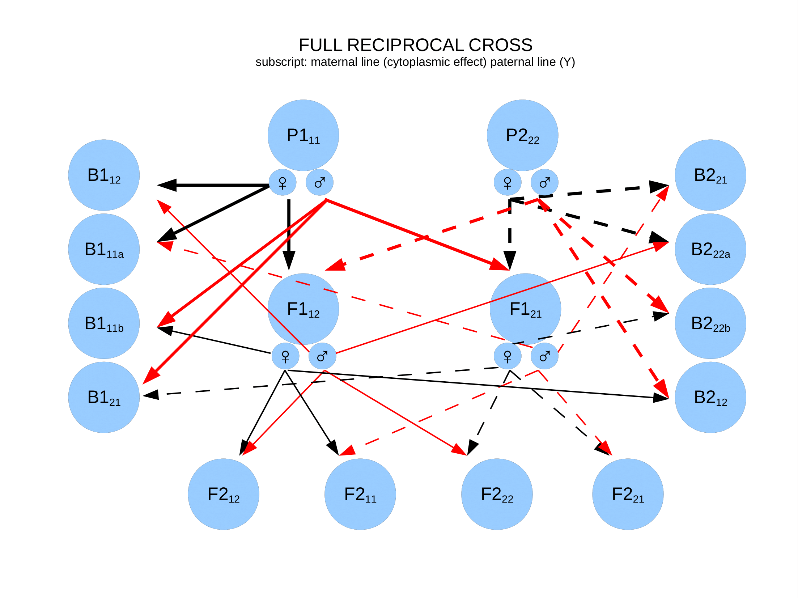

```{r}
library(linecross)
```

## Data

This data is from Demuth and Wade (2007) on crosses between populations of the red flour beetle *Tribolium castaneum*. This is the same worked example as in Bolstad et al. (XXXX) that accompanies the package. The original data consists of crosses between 12 populations, but here we will concentrate on one cross between two populations (Tanzania and Mexico). The focal trait is number of offspring produced at 29$^\circ$C. The data, which are extracted from figures of the supplement of Demuth and Wade (2007), includes a full spectrum of reciprocal crosses with two parentals, a Tanzanian population (P1) and a Mexican population (P2), two reciprocal F1s, four F2s and eight back crosses:

```{r}
tribolium
```
This data format is required for fitting the different line-cross models using `lcross` function. The three required columns are the name of the derivative (see figure below for explanation), the mean of each derivative and the standard error of this mean. The name of the columns must be exactly as in this example and also the name of the derivatives. The derivatives column must be formatted as `character`, and means and standard errors must be `numeric`. The fourth column, n, is not required. For the Tribolium data it gives the number of mating pairs.

The first number in "subscripts" of the derivatives (i.e. what is written after _) represent the maternal line, so that 1 means that the maternal line originates from P1 and 2 means that the maternal line originates from P2. The second number represent the paternal line. This figure illustrates the setup, with black solid and dashed lines indicating maternal inheritance from P1 and P2, respectively, and red solid and dashed lines indicating paternal inheritance from P1 and P2 respectively:

```{r, out.width = '100%', echo = FALSE}

```

There are no-reciprocal models, at least not yet, in the `linecross` package, but the data format is set up in such a way that such models can be included in the future. Because the currently implemented models does not use reciprocal information, the models does not differentiate between the different F1s, F2s, B1s or B2s, but rather uses the weighted average of each group. Hence, in cases where the are no reciprocal information available in the data, say there is only one mean for F2, which includes all or some of the possible reciprocal crosses, it does not matter for the model fitting whether this F2 is labelled F2_12, F2_21, F2_11 or F2_22 in the data file. 

## Measurment scale
The data as presented in the original paper is number of offspring. Since this is a fitness component, and differences in fitness are often compared on a proportional scale, we transform the data to the log scale using approximations before the analysis.

```{r}
d<-tribolium
d$means <- with(tribolium, log(means)-0.5*(n*se^2/means^2))
d$se    <- with(tribolium, se/means)
d
```
## Models
Because we have data on a fitness component (number of offspring) it makes sense to test what type of epistasis that that is involved in postzygotic isolation. These are all versions of the general epistasis model. We chose to use F1 as the reference in our models. The reference is the population in which the genetic effects are measured. 

```{r}
modlist <- list(
  "Additive" = lcross(model = "additive", reference = "F1", data = d),
  "Dominance" = lcross(model = "dominance", reference = "F1", data = d),
  "Additive and dominance" = lcross(model = "add_dom", reference = "F1", data = d),
  "Within pop epistasis" = lcross(model = "generalW", reference = "F1", data = d),
  "Between pop epistais" = lcross(model = "generalB", reference = "F1", data = d),
  "Within and between pop epistasis" = lcross(model = "generalWB", reference = "F1", data = d),
  "Full general epistasis model" = lcross(model = "general", reference = "F1", data = d))

cbind(
  "k" = lapply(modlist, function(x) length(x$parameters)),
  "R-squared" = lapply(modlist, function(x) round(x$Rsquare, 2)),
  "AIC" = lapply(modlist, function(x) round(x$AIC, 1)))
```
The within and between population epistasis model has a slightly better AIC value compared to the full general epistasis model. The difference between these two models is that the within population epistasis is allowed to differ between the two populations in the full model. 

```{r}
cbind(
  "Estimate" = modlist$`Full general epistasis model`$parameters,
  "SE" = modlist$`Full general epistasis model`$parameters.se)
```
The reference effects Y1 and Y2 were both negative, but the effect of substituting P1P1 genoypes into the reference, given by Y1, is stronger than the effect of substituing P2P2 genotypes into the reference. From the reference effects we see that the P1 has `1-exp(Y1) ` = `r round(100-exp(-3.669357)*100, 1)`\% less offspring than the reference, in the absence of epistasis. Including epistasis, the P1 has `1-exp(Y1+Ew) ` = `r round(100-exp(-3.669357+3.471195)*100, 1)`\% less offspring than the reference. 


```{r}
cbind(
  "Estimate" = modlist$`Full general epistasis model`$parameters,
  "SE" = modlist$`Full general epistasis model`$parameters.se)
```


```{r}
par(mfrow = c(1,2))
plot_linecross(modlist$`Within and between pop epistasis`,
               data = d, theta=-60, phi=20, margins=c(2,2,2,2),
               col.triangle="gray80")
plot_linecross(modlist$`Full general epistasis model`,
               data = d, theta=-60, phi=20, margins=c(2,2,2,2),
               col.triangle="gray80")
par(mfrow = c(1,1))
```


within population epistasis is forced to be equal between within and between population epsitasis model, while it can differ between P1 and the P2 poulation in the full model. 


